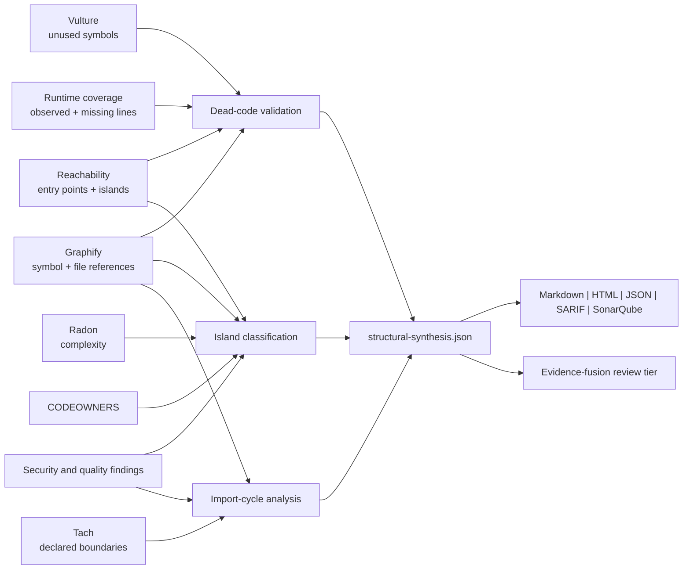

# Structural synthesis

Last reviewed: 2026-08-12

Structural synthesis combines independent repository signals so reviewers can
act on code-island and dead-code results without treating a single static tool as
proof. It runs after scanner normalization and writes
`structural-synthesis.json`; no target code, network service, model, or database
is required.

## Evidence joins

| Join | Stronger conclusion | Important counter-evidence |
|---|---|---|
| Vulture + disconnected scope + uncovered line + no Graphify inbound reference | `likely-removable` candidate | Missing dynamic root or production-only path |
| Vulture + observed runtime scope or inbound symbol reference | `likely-dynamic` candidate | Observation may be test-only; caller still needs validation |
| Disconnected/load-only island + security finding | `latent-attack-surface` | State does not establish exploitability |
| Disconnected island + external Graphify caller | `missing-entry-point` | Reference can still be non-executable |
| Graphify import cycle + Tach/security finding | High-priority architecture hotspot | Cycles indicate coupling, not a vulnerability by themselves |

## Dead-code dispositions

| Disposition | Meaning | Action |
|---|---|---|
| `likely-removable` | Several independent signals support focused removal review | Confirm ownership and dynamic behavior, remove narrowly, test, and rescan |
| `likely-dynamic` | Runtime observation or graph references contradict a dead-code conclusion | Trace callbacks, registries, plugins, reflection, and framework conventions |
| `needs-review` | Evidence is missing or mixed | Model entry points and collect production-like coverage before deciding |

The suite never automatically deletes code, changes scanner severity, or
suppresses a Vulture result. A high-confidence synthesis means confidence in the
reported evidence combination, not proof that production cannot execute the
code.

Vulture's quoted symbol name is matched to the normalized Graphify label before
the line-nearest fallback is used. Symbol-level inbound references drive the
disposition; file-level imports remain visible counter-evidence and lower
confidence instead of incorrectly proving that every definition in an imported
module is live.

## Island classifications

- `latent-attack-surface`: dormant or load-only code contains a security or
  supply-chain finding;
- `missing-entry-point`: static reachability says disconnected while Graphify
  finds cross-island callers or imports;
- `likely-dynamic`: runtime observation or load-only state suggests indirect use;
- `likely-removable`: disconnected, unreferenced code also contains Vulture
  candidates; and
- `orphaned-code-review`: ownership and intent remain unresolved.

Each island includes stable identity, state, confidence, LOC, priority, impact
score, paths, external graph references, runtime observation, coverage,
complexity, owners, related finding IDs, evidence, counter-evidence, and a
specific next action. Import strongly connected components are separately listed
with Tach and security correlations.

## Report contract and limits

The artifact uses bundled JSON Schema `structural-synthesis-1.0`. Output is
bounded to 100 dead-code assessments, 100 island assessments, 50 import cycles,
and 250 finding links; omitted counts are explicit. Relevant findings receive a
compact `structural_synthesis` evidence object and supporting Graphify and
reachability citations. The main summary shows counts and the five highest-value
islands, while the full artifact preserves machine-readable evidence.

Static analysis cannot completely model reflection, dependency injection,
generated code, native extensions, data-driven plugins, or framework dispatch.
Runtime non-observation also does not prove absence. A removal decision therefore
requires owner review, production-representative tests, and a clean reachability
delta and isolated rescan.
