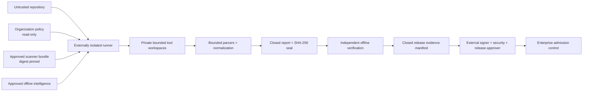

# Suite threat model

Last reviewed: 2026-08-08

The suite analyzes untrusted repositories with locally installed scanners and
normalizes their output into sealed evidence. Its primary security objective is
to prevent a compromised repository, scanner, database, or report artifact from
minting its own production authorization.

## Assets and trust boundaries

- **Protected assets:** source confidentiality, scanner integrity, policy and
  trust catalogs, intelligence snapshots, signing keys, normalized evidence,
  release artifacts, and admission decisions.
- **Untrusted inputs:** repository files, archives, scanner stdout/stderr,
  SARIF/JSON/XML, companion evidence, baselines, and downloaded artifacts.
- **External authorities:** network isolation, scanner/intelligence approval,
  private-key custody, immutable retention, deployment, and release admission.
- **Suite guarantees:** no target imports by native static adapters, bounded
  input sizes, link/path rejection, private per-tool workspaces, before/after
  executable and source identities, atomic artifact publication, and checksum
  verification before derived decisions.

## Threats and controls

| Threat | Preventive/detective controls | Residual risk and required owner |
|---|---|---|
| Repository executes during analysis | Static adapters avoid imports; runtime tools require explicit companion lanes | Scanner vulnerabilities still need OS sandboxing; platform security |
| Scanner or helper is replaced | Exact executable digests, auxiliary identities, organization trust catalog, before/after checks | Publisher compromise requires bundle provenance review; security tooling |
| Scanner exfiltrates source | Offline arguments plus external egress-denied runner attestation | The suite cannot enforce its parent network namespace; platform security |
| Stale or poisoned intelligence | Digest-bound snapshots, freshness checks, organization approval | Snapshot acquisition and provenance remain external; vulnerability management |
| Malformed output exploits parser | Size/depth/count bounds, strict shapes, defensive parsers, regression/fuzz tests | Native parser/library defects remain possible; suite maintainers |
| Finding is hidden by aggregation | Source attribution, native rule, classifications, locations, context, citations, fingerprints, and multi-source retention | Scanner blind spots require corpus and disagreement review; AppSec |
| Baseline hides a regression | Same profile/tool set, source identity, and verified VCS ancestry for production/release | Baseline approval and retention remain external; release engineering |
| Artifact/report substitution | Closed inventory, SHA-256 seal, report verification, payload verification, release-manifest verification | SHA-256 and storage controls must remain approved; release engineering |
| Repository self-approves | Organization facts cannot be weakened by repository config; candidates remain `authoritative: false` | External policy and approvers must be independently controlled; security governance |
| Signing key theft | No key storage in reports; controlled signing request and exact subjects | HSM/keyless identity policy and incident response remain external; signing authority |
| Denial of service | Timeouts, output limits, bounded concurrency, size caps | Adversarial CPU/memory exhaustion needs runner quotas; platform security |
| Sensitive report disclosure | Sanitization, minimized raw output, retention classes | Encryption, access control, and deletion are enterprise storage responsibilities |

## Abuse-case verification

Release validation should exercise these cases at least quarterly:

- changed scanner binary between preflight and execution;
- symlink/junction or archive traversal into/out of the target;
- oversized, deeply nested, malformed, or terminal-control scanner output;
- stale intelligence, expired trust entry, and mismatched evidence digest;
- report file addition, deletion, or mutation after sealing;
- incomparable baseline and non-ancestor source revision;
- missing signature bundle, substituted distribution, or extra payload subject;
- interrupted scan and partial artifact publication;
- unavailable required scanner and conditional input incorrectly claimed as covered.

Any failure must produce `INCOMPLETE`, `NOT_APPROVED`, or an equivalent blocking
receipt. A clean scan is evidence about configured controls—not proof of safety.
