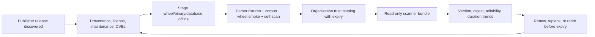

# Scanner bundle lifecycle

Last reviewed: 2026-08-08

The [compatibility matrix](compatibility-matrix.md) describes every adapter and
its coverage. This document governs how the executable bundle stays trustworthy.

| Component class | Examples | Required admission evidence | Review cadence |
|---|---|---|---|
| Python analyzers | Bandit, Semgrep, Ruff, mypy, Pylint, Vulture, Radon, Tach | locked wheel set, publisher/source identity, hashes, license, parser and corpus tests | monthly and on every upgrade |
| Standalone analyzers | CodeQL, OSV-Scanner, Trivy, Grype, Syft, Gitleaks, TruffleHog, actionlint | release provenance/signature, binary hash, platform matrix, database binding where applicable | monthly and on every upgrade |
| Intelligence databases | OSV, Grype, Trivy, ClamAV, YARA inputs | snapshot digest, acquisition source, timestamp/revision, validity window, organization approval | organization-defined freshness; verify every scan |
| Companion producers | ZAP, Schemathesis, CrossHair, Atheris, mutmut, pytm, in-toto, reproducible build | producer identity, isolated-run receipt, strict evidence schema, source/report binding | quarterly and on producer change |
| Suite package | `py-security-suite` wheel/sdist | clean build, Twine check, wheel-content check, offline wheel smoke, SBOM, self-scan | every candidate release |

## Upgrade and retirement gates

- Never use floating versions in the production bundle.
- Test new and previous versions side by side against parser fixtures and the
  labeled positive/negative corpus; investigate disagreements before approval.
- Record tool, primary and auxiliary executable digests, parsed version,
  platform, source, approver, and expiry in organization policy.
- Alert on completion-rate regression, new `unknown` versions, applicability
  changes, executable changes, or duration regression from `pysec trend`.
- Retire tools that are unmaintained, repeatedly unreliable, legally
  unacceptable, redundant without unique yield, or unable to operate within the
  isolation boundary. Replace coverage before removing a required perspective.
