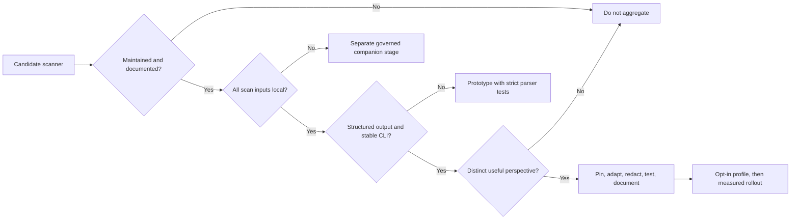

# Tool selection and portfolio governance

Last reviewed: 2026-08-09

The suite favors tools that are mature, produce structured output, have a
documented non-interactive CLI, can consume only local inputs, and add a
distinct perspective. A scanner is not made required until its binary,
rules/data, platform support, timeout behavior, output parser, applicability,
redaction, and failure semantics are governed.

## Added maturity layer

| Tool | Why it belongs | Report domain | Enterprise isolation treatment |
|---|---|---|---|
| [Ruff](https://docs.astral.sh/ruff/linter/) quality pass | Fast independent correctness, bug, complexity, performance, and upgrade rules using the already-approved Ruff binary | quality | Isolated config, no cache |
| [Ruff formatter](https://docs.astral.sh/ruff/formatter/) | Deterministic formatting check that reduces review noise without changing source during a scan | quality | `--check`, isolated config, no cache |
| [Pylint](https://pylint.readthedocs.io/) | Mature second Python analyzer for correctness, exception handling, logging, and maintainability smells | quality | Suite-controlled policy, one worker, temporary source mirror |
| [mypy](https://mypy.readthedocs.io/) | Finds invalid type contracts and ambiguous error paths that pattern SAST does not model | quality | Follows repository-local imports while ignoring unavailable third-party imports; does not use target site packages |
| [Vulture](https://github.com/jendrikseipp/vulture) | Identifies certainly unused or unreachable code that expands review and attack surface | quality | Only 100% confidence is reported |
| [Radon](https://radon.readthedocs.io/) | Independent cyclomatic-complexity measurement with full rank C+ evidence and focused rank D/E/F findings | quality | Local source only; generated roots excluded |
| [Tach](https://docs.gauge.sh/) | Enforces repository-owned module dependencies, dependency direction, cycles, layers, and public interfaces | quality | Requires local `tach.toml`; static analysis does not import or execute target code |
| [Reachability analysis](reachability.md) | Traces representative paths from application roots and ranks disconnected module or symbol islands by size | quality | Bundled AST-only analyzer; no target imports, execution, network, database, or Docker |
| [Graphify](graphify.md) | Builds a code-property graph and adds blast radius, structural hubs, and cross-tool finding neighborhoods | quality | Pinned `graphifyy` sidecar; code-only AST mode, no clustering/model calls, no target execution |
| [Finding accuracy synthesis](analysis-accuracy.md) | Separates static candidates, corroborated observations, native static paths, runtime observations, and reproduced failures without converting missing evidence into safety | security/quality | Bundled deterministic join over retained normalized evidence; no target execution |
| [Framework model coverage](analysis-accuracy.md) | Discovers security-relevant Python frameworks and requires digest-bound CodeQL/Pysa/Semgrep models plus executed positive and negative rule canaries | security | Bundled AST import discovery and source-bound manifest validation; model execution remains with its governed engine |
| [Application contracts](analysis-accuracy.md) | Reconciles code routes and OpenAPI auth, verifies declared allow/deny/tenant test IDs, finds exact advisory calls, and emits capability-routed argv tasks with actor/oracle/subject bindings | security/architecture | Bundled AST plus retained JSON contracts and governed test artifacts; generated tasks are plans, authorization/replay stays with the authorization companion, and dynamic dispatch/exploit preconditions remain explicit limitations |
| [Code and architecture health](analysis-accuracy.md) | Adds cognitive complexity, responsibility/cohesion, async and exception lifecycle defects, ranked bounded retention, unified executable entry points, native/Tach policy enforcement, cycles/fan-out, bounded Git co-change, and finding/change hotspots | quality/architecture | Bundled AST plus already-sealed bounded Git history; policy violations are exact contract failures while topology and co-change remain review signals |
| [Sensitive-data exposure synthesis](data-exposure.md) | Joins Semgrep/Pysa/CodeQL evidence and inventory-only sinks to logs, telemetry, request collections, URL queries, client errors, SDK configuration, reachability, coverage, runtime observations, graph impact, CODEOWNERS, graph-selected tests, change risk, structural hotspots, normalized package findings, source/artifact SDK lineage, nearby findings, and evidence-fusion triage | security | Bundled AST inventory and immutable rules; no target imports, execution, SDK calls, or network access; inventory and SDK-package context prioritize review but do not assert disclosure or exploitability |
| [coverage.py](https://coverage.readthedocs.io/) evidence | Makes aggregate and per-file branch-coverage gaps visible without running tests in the scanner boundary | testing | Validates bounded pre-generated JSON; top ten hotspots become findings |
| JUnit XML evidence | Makes failed tests visible in the same action plan and assurance case | testing | Bounded, entity-free metadata ingestion; failure bodies and process output are discarded |
| [actionlint](https://github.com/rhysd/actionlint) | Validates GitHub Actions syntax, expressions, matrices, dependencies, and runner semantics | quality | Explicit workflow inputs; optional ShellCheck and pyflakes subprocesses disabled |
| [Hadolint](https://github.com/hadolint/hadolint) | Adds Dockerfile correctness, reproducibility, and hardening guidance | security | Explicit local Dockerfiles and a local policy file |
| [Microsoft DevSkim CLI](https://github.com/microsoft/DevSkim/wiki/Command-Line-Interface) | Adds a multi-language security-pattern engine independent of Python-only SAST | security | Scans a temporary maintained-source mirror; local NuGet installation |
| [Flawfinder](https://dwheeler.com/flawfinder/) | Covers C/C++ extension boundaries that Python scanners cannot inspect | security | Conditional local SARIF scan of native source |
| [REUSE](https://reuse.readthedocs.io/) | Enforces machine-readable SPDX license and copyright metadata | governance | Explicit repository opt-in; local `reuse lint --json` |
| [PSScriptAnalyzer](https://learn.microsoft.com/powershell/utility-modules/psscriptanalyzer/overview) | Adds security, correctness, compatibility, and maintainability checks for PowerShell automation | security | Pinned staged module, suite settings, reduced PowerShell environment |
| [ShellCheck](https://github.com/koalaman/shellcheck) | Detects unsafe shell expansion, injection, data-loss, and portability patterns | security | Checksum-pinned local binary and explicit script inputs |
| [deptry](https://deptry.com/) | Validates missing, unused, transitive, and development-only dependency declarations | supply-chain | JSON file output outside the target; use a prepared dependency-analysis environment |
| [diff-cover](https://github.com/Bachmann1234/diff-cover) | Focuses test adequacy on new and modified executable lines | testing | Reads pre-generated coverage XML and local Git history; never runs tests |
| [Pyright](https://microsoft.github.io/pyright/) | Adds a second type-inference implementation beside mypy | quality | Pinned Node runtime and locally staged CLI package; predictable suite-owned `basic` baseline keeps aggregate triage readable |
| [Checkov](https://www.checkov.io/) | Adds graph-aware Terraform, Kubernetes, cloud template, OpenAPI, and pipeline policy coverage | security | `--skip-download`, external-module downloads disabled, separate Python sidecar |
| [Cosign](https://docs.sigstore.dev/cosign/) | Verifies release artifact signatures, signer identity, and digest binding | supply-chain | Local artifacts, bundles, keys, and trusted roots only |
| [OpenSSF Scorecard](https://scorecard.dev/) evidence | Adds branch, review, CI, dependency-update, and release governance context | governance | Networked collection remains separate; the suite only validates bounded pre-generated JSON |
| [Conftest](https://www.conftest.dev/) | Organization-owned OPA/Rego policy across structured repository configuration | governance | Local policy directory; no pulls |
| [KICS](https://docs.kics.io/latest/) | Independent Checkmarx IaC security/compliance query engine | security | Locally built native CLI and matching local query assets; no Docker or downloads at scan time |
| [pipdeptree](https://pipdeptree.readthedocs.io/) | Runtime dependency conflicts, cycles, depth, and license summary | supply-chain | Explicit approved target Python only |
| [git-sizer](https://github.com/github/git-sizer) | Git history and repository scaling hazards | quality | Full local checkout and JSON v2 |
| [validate-pyproject](https://validate-pyproject.readthedocs.io/) | PyPA metadata and schema validity | quality | Embedded schema; network disabled |
| [Vale](https://vale.sh/) | Documentation clarity and organization terminology | quality | Local configuration and styles only |
| [KubeLinter](https://docs.kubelinter.io/) | Kubernetes/Helm security and production-readiness policy | security | Local manifests only |
| Hypothesis, Schemathesis, CrossHair, Atheris, mutmut, and ZAP evidence | Property, API, symbolic, fuzz, mutation, and DAST failures | testing/security | Execution stays in disposable trusted lanes; suite validates bounded JUnit or JSON only |
| pytm, check-manifest, ClamAV, YARA, in-toto, reproducibility, and GitHub attestation evidence | Design threats, package completeness, malware, build integrity, and provenance | security/supply-chain | Potentially executable or release-bound verification stays in companion lanes |

## Admission criteria

Portfolio overlap is intentional where independent implementations improve
confidence. Correlation prevents two tools observing the same logical issue at
the same location from becoming two risk votes; all source tools and native
rules remain attached to the consolidated finding.

## Evaluated repository-health layers

These controls can expand assurance, but are deliberately outside required
profiles until their evidence contracts satisfy the same admission criteria:

| Domain | Candidate | Decision and rationale |
|---|---|---|
| API documentation | [interrogate](https://interrogate.readthedocs.io/) | Deferred: useful optional coverage percentage, but its CLI does not provide a stable structured per-symbol diagnostic contract suitable for normalized finding citations. A repository may run it as a separate maintainability gate. |
| Secondary typing | [ty](https://docs.astral.sh/ty/type-checking/) | Experimental only: its fast independent analysis and JUnit/GitLab output are promising, but upstream still labels the tool beta and explicitly permits breaking diagnostics between `0.0.x` releases. Re-evaluate after a stable contract. |
| Behavioral resilience | Hypothesis, Atheris, mutation testing, and contract/API testing | Admitted through separate dynamic companion jobs with disposable credentials, resource limits, and a test-appropriate network policy; CrossHair, Atheris, mutmut, Schemathesis, and ZAP feed bounded results back into the aggregate. |

The preferred reporting evolution is to ingest evidence from those companion
lanes into the same assurance case, while retaining distinct outcomes for
static source analysis, test execution, artifact verification, and operational
security. This avoids calling an untested code path "safe" merely because its
static scan was clean.

## Evaluated but not placed in the static aggregate

| Candidate | Decision |
|---|---|
| KICS distribution | Upstream no longer publishes standalone binaries. The adapter is admitted, while enterprises build the native CLI from the pinned source release and stage its matching query tree; Docker is not required. |
Hypothesis, Schemathesis, and OWASP ZAP remain sandboxed companion controls,
but now have governed adapters that attribute and consolidate their findings.
| dep-scan or online advisory clients | Rejected when reliable operation depends on live services or dependency resolution. OSV-Scanner and Grype use approved local snapshots instead. |

## Review cadence

At every tool update, revalidate release provenance and checksums, supported
platforms, CLI flags, offline behavior, exit codes, output schemas, licenses,
rule/database freshness, false-positive rates, and runtime limits. A portfolio
count is not a security claim: production approval still requires threat
modeling, tests, final artifact identity, provenance, and governed exceptions.
