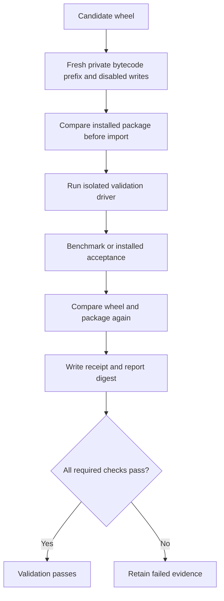
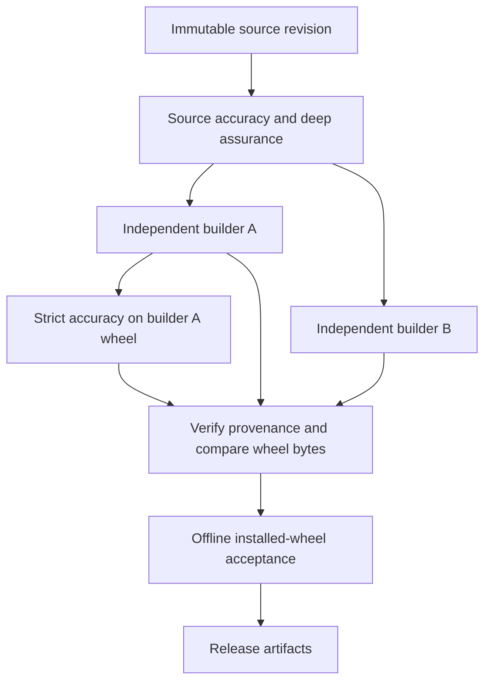
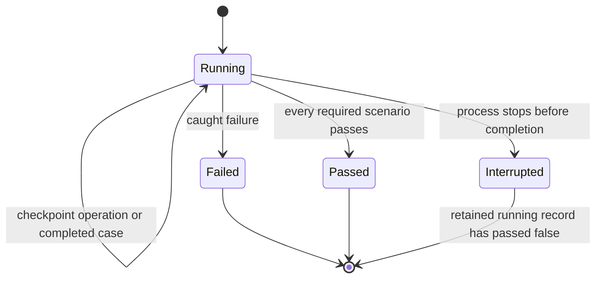
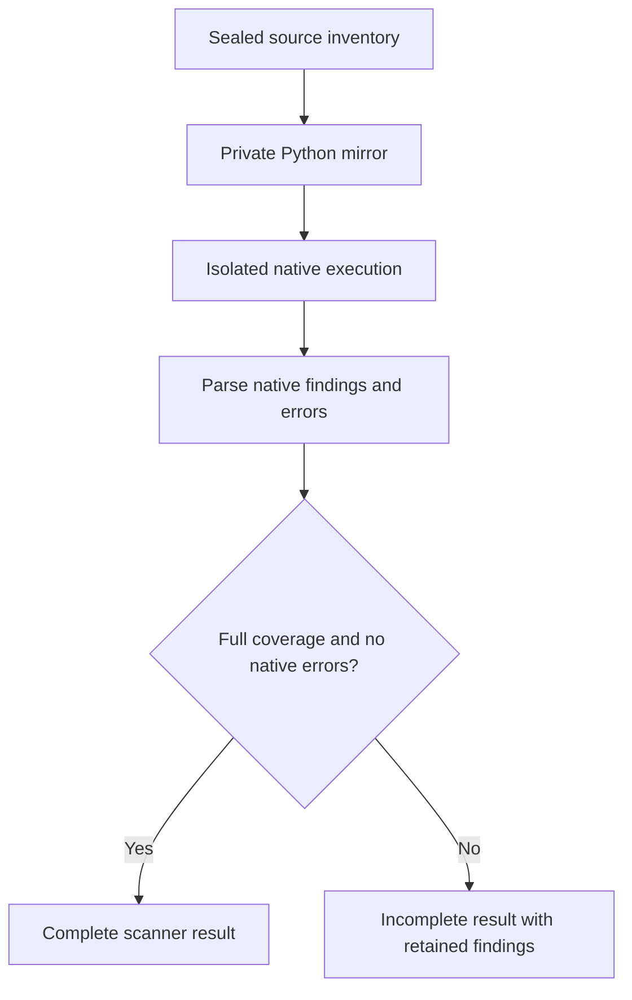
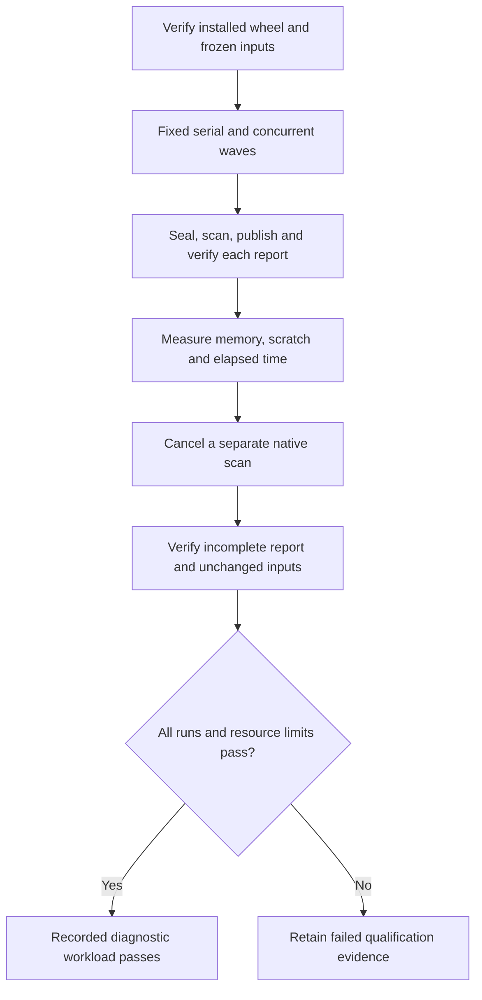
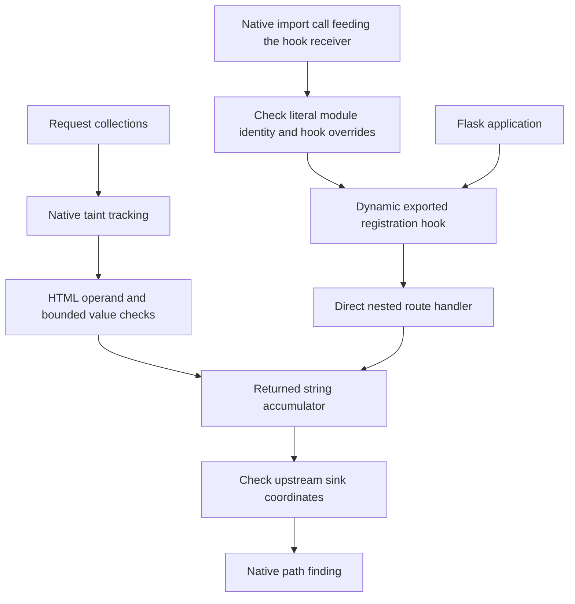
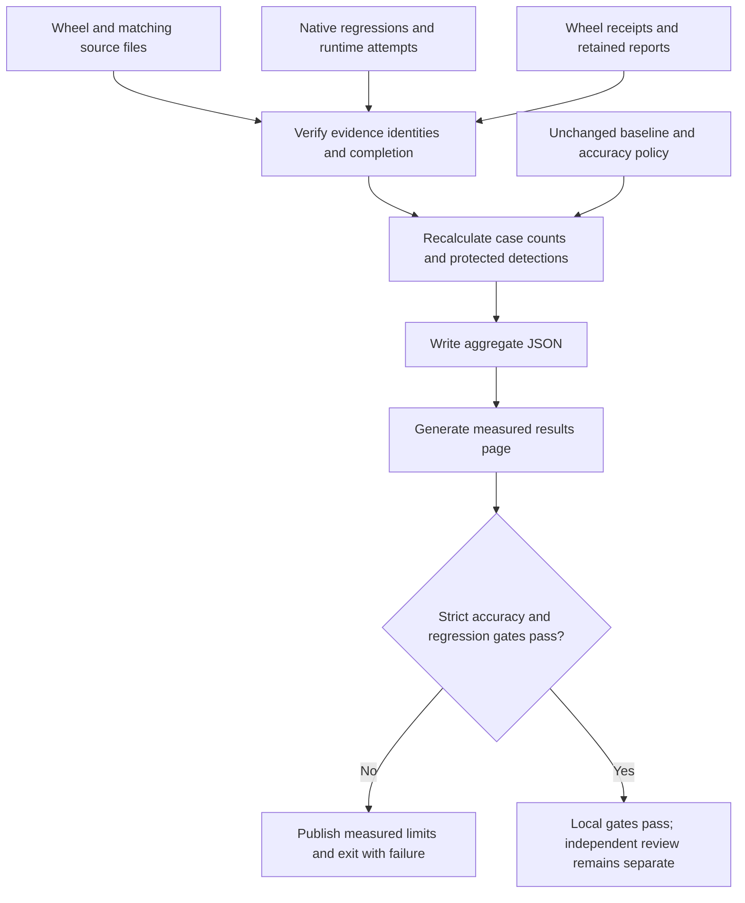

# Validation pipeline and evidence boundaries

Last reviewed: 2026-09-12

Native detector regressions, measured accuracy and production approval are separate
decisions. The [acceptance record](professional-acceptance.md) records completed
local measurements and remaining gaps. The public benchmark is development data;
it is not an independently reviewed holdout.

## Validate the wheel that will be distributed

`scripts/validate_wheel_detection.py` runs under Python isolated mode (`-I`) in an
environment containing the candidate wheel. Before importing the product, it
locates its installed package, requires a `site-packages` installation and compares
every product package file with the wheel. Missing, modified, extra and linked
package files fail verification. Generated `__pycache__` files are excluded from
the byte comparison, but the validator establishes a fresh private
`sys.pycache_prefix` before importing validation helpers or the product and
disables bytecode writes. Acceptance children and qualification interpreters use
`-I -B -X pycache_prefix=<fresh-directory>`. `-I` or `-B` alone does not prevent
reading an existing cache. Timestamp-valid altered bytecode is an adversarial
regression control for both product and helper imports.
The wrapper bounds archive size, entry counts and expanded package bytes.

The wrapper executes the benchmark or installed-product acceptance driver and
repeats the wheel and package comparison afterwards. Its receipt records the
wheel digest, installed package identity, driver hashes, report digest and exit
status. An intact artifact with failed accuracy remains a failed run. This check
does not equate the wheel with its separately installed third-party dependencies.



The reusable detection workflow either builds a candidate or downloads the
supplied wheel artifact, installs locked runtime dependencies and tests that
wheel. Release assurance also applies strict accuracy to builder A's actual
release wheel. The final release comparison requires this job, verifies both
builders' provenance and byte equality, and exercises the wheel offline.



These are workflow requirements. A local run does not prove that remote CI ran
or that a release was published.

## Retain incomplete and failed validation evidence

`scripts/validation_evidence.py` checkpoints installed-product acceptance before
each operation and after each completed scenario. Native regression commands,
external benchmark engines and Semgrep qualification attempts also checkpoint
progress. Writes flush and use an atomic replace.
Each invocation gets a unique run directory, so reusing the latest output path
does not erase earlier runs. Interrupted runs retain `passed: false` and their
last stage; a `running` record must never be accepted as success.

The wheel wrapper archives its receipt and exact report bytes in its unique run
directory. It initializes the output report as incomplete before calling the
driver, preventing a driver that emits no report from reusing stale success.
Output paths cannot overwrite the candidate wheel. Disk-full fault injection
checks that a failed replacement leaves the preceding checkpoint intact;
concurrent-run tests check that each archive remains distinct.



For generated acceptance fixtures, the journal retains normalized scan manifests,
findings and selected detector evidence before checking assertions. Retention is
bounded to 16 MiB per file and 64 MiB per scenario. Raw process output is represented
by byte counts and hashes. Failure records contain the exception category and
stack locations, without exception text, source snippets or local variables.
This journal is a local diagnostic record, not a signed production attestation.

## Production execution and complete Python coverage

The production command runner creates a private runtime home, temporary directory
and Python bytecode prefix for every invocation. It disables bytecode writes and
passes `-B -X pycache_prefix=...` to direct Python commands, including commands
using `-I` or `-E`. Callers cannot override the protected cache environment keys.
This extends the cache boundary beyond the validation drivers. Adversarial tests
retain a timestamp-valid altered cache and require execution of the source marker.

Bandit and Semgrep receive a private mirror of the suite's maintained Python
inventory. The mirror preserves relative paths and includes an empty root
`.semgrepignore`; Semgrep also receives `--no-git-ignore`. Repository ignores and
Semgrep's default test-directory exclusions therefore cannot silently reduce the
declared scan inventory. Native errors, timeouts and missing files still make a
scan incomplete. The mirror is removed after parsing the native result.

Post-scan verification hashes both the original source and the sealed scan copy.
Cancellation interrupts this work rather than forcing another full repository
read. An interrupted verification records source integrity as unverified and
keeps the outcome incomplete. The report's own checksums can still be verified;
they do not establish an unverified source identity or authorize release.



Bandit's live B608 refinement excludes only an assignment whose unchanged source
proves an interpolation-free f-string. Dynamic interpolation, ambiguous statements
and imported reports retain the original alert. Each exclusion retains the native
finding and source digest; the benchmark's labels and accuracy targets are unchanged.

## Measure full-pipeline capacity

`scripts/qualify_native_capacity.py` runs the installed candidate through source
sealing, native scanning, report publication and checksum/passport verification.
It compares installed package bytes with the candidate wheel before and after the
qualification, binds the source and configuration, and retains each worker result
in a unique evidence directory. Workers use isolated Python with fresh caches.

Fixed waves at concurrency one and the selected concurrency run at least three
times each. Each wave samples aggregate process-tree resident memory and private
scratch. A separate cancellation run must retain a verifiable incomplete report
within 15 seconds of cancellation. All ordinary runs must complete every enabled
scanner, preserve source integrity and produce stable finding identities. Invalid
worker JSON and contradictory exit status fail qualification.



These are measured limits for the recorded source, host and profile. They do not
establish cold-cache behavior, a service latency percentile, physical disk-full
recovery or an independently approved operating range.

## Qualify the scanner runtime

`scripts/qualify_semgrep.py` invokes the installed Semgrep console entry point
through the scanner environment's own isolated interpreter. It compares the
launcher, rule bytes and runtime closure before and after every scan. The closure
includes the interpreter, standard library, Semgrep dependency files and resolved
native dependencies. On Windows, Python native dependencies resolve against the
base interpreter installation and the installed pywin32 DLL directory as well as
the ordinary native search roots. Unresolved dependencies fail qualification;
the resolver does not search arbitrary user `PATH` entries.

Every configured repetition must complete with the full expected file inventory
and the same findings. Earlier failed attempts remain in the qualification report.
Completed attempts and each identity check are saved as they finish. Separate
`identity_checks` durations show the cost of initial and before/after runtime
verification, while `native_invocations` describe the scans themselves. These
checks are retained even when they dominate execution time; the implementation
does not substitute a cached digest for a fresh runtime verification.
Changes to the launcher alone cannot stand in for an unchanged runtime. Static
dependency resolution still does not prove the identity of every possible plugin
or dynamically loaded library outside the modeled closure.

Resource measurements sample the qualification driver and native child process
tree with a 100 ms pause between samples, plus collection overhead. They record
peak observed resident memory and the private
temporary workspace's peak observed bytes. External caches are outside that
scratch measurement; short peaks between samples can be missed. These are
measurements of the tested corpus and host, not a maximum repository size, a
capacity guarantee or a latency percentile. Synthetic lifecycle tests remain
separate evidence for cancellation and recovery behavior.

## Dynamic Flask HTML coverage

The supplemental CodeQL query follows request collection values into string
responses returned from a narrow dynamic registration pattern. A native
`importlib.import_module` call must feed the receiver of the exported hook call
with a Flask application. A literal module name, including a locally propagated
literal, must match the hook's defining module. Rebound exports, duplicate hook
definitions and observed writes to that imported hook are excluded. The modeled
handler is directly nested in that hook, has one literal
route decorator on the unchanged application parameter and returns a local string
accumulator. Results carry native dataflow paths. An existing upstream reflected
XSS result at the same sink coordinates prevents a duplicate supplemental result.



The model covers args, form, values, headers and cookies. HTML escaping must
account for every already trusted Markup operand: escaping another operand does
not make attacker-controlled `Markup` safe. Constant-value proofs use bounded
native AST and dataflow facts and reject unsupported writes and mutations.

Nonliteral dynamic module identity remains unknown, so matching exported hook
names can overapproximate those registrations. The query retains medium precision.
General routing,
middleware behavior, arbitrary response builders, URL path constraints and
unmodeled framework conventions are outside this contract. The query is not a
general proof that an application is free of XSS.

## Independent production evaluation

Before a production-readiness claim, freeze a separate corpus of representative
Flask, Django and FastAPI applications at recorded revisions, with vulnerable and
fixed labels reviewed by someone independent of the detector changes. Run the
existing [governed benchmark workflow](benchmark-operations.md), retain reviewed
labels, coverage, runtime identity and signed evidence, and apply the unchanged
accuracy policy. Do not relabel difficult cases or tune against that holdout and
continue calling it independent. This implementation provides validation controls;
it does not manufacture independent review or certification.

The [production evaluation work package](production-evaluation.md) specifies the
review inputs and operating measurements still required.

## Generate documentation from verified evidence

`scripts/aggregate_validation.py` replaces the previous local, ad hoc aggregation
script. It checks the exact wheel against the source package, native corpus and
query identities, completed runtime repetitions, both wheel receipts and retained
acceptance files. Receipt driver digests must match the current versioned scripts.
It recalculates per-engine and combined counts from case evidence, enforces the
current baseline including every protected detection, and recomputes the accuracy
decision using the unchanged policy. Duplicate JSON keys, nonstandard numeric literals,
partial coverage, missing scenarios and inconsistent results are rejected.



Run from the repository root after freezing validation scripts and completing all
measurements for the same wheel. Supply the actual evidence paths:

```text
python scripts/aggregate_validation.py --wheel <candidate.whl> --native <native.json> --runtime <runtime.json> --benchmark <benchmark.json> --benchmark-receipt <benchmark-wheel.json> --acceptance <acceptance.json> --acceptance-receipt <acceptance-wheel.json> --baseline tests/fixtures/external-benchmark-source-security.baseline.json --policy tests/fixtures/external-benchmark.accuracy-policy.json --output <aggregate.json> --markdown docs/validation-results.md
```

A fully verified measurement that fails strict accuracy or a regression ceiling
still produces its table, identifies the failed gates and exits with status 1.
The aggregator recalculates regression failures from case counts and requires the
reported failure list to agree; missing, duplicate or invented failures are rejected.
Protected detections must still be retained. Rejected evidence replaces any previous generated page
with an explicit rejection notice, preventing stale success from remaining
published. Input files cannot be selected as outputs. The resulting
[measured results page](validation-results.md) includes input digests.

This is a local integrity and consistency verifier. Its hashes are not signatures
and it does not authenticate a malicious evidence producer. Trusted release
provenance and independent approval remain separate controls.
